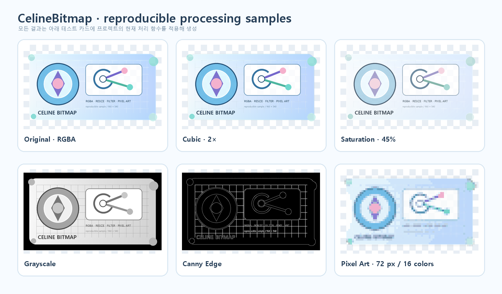
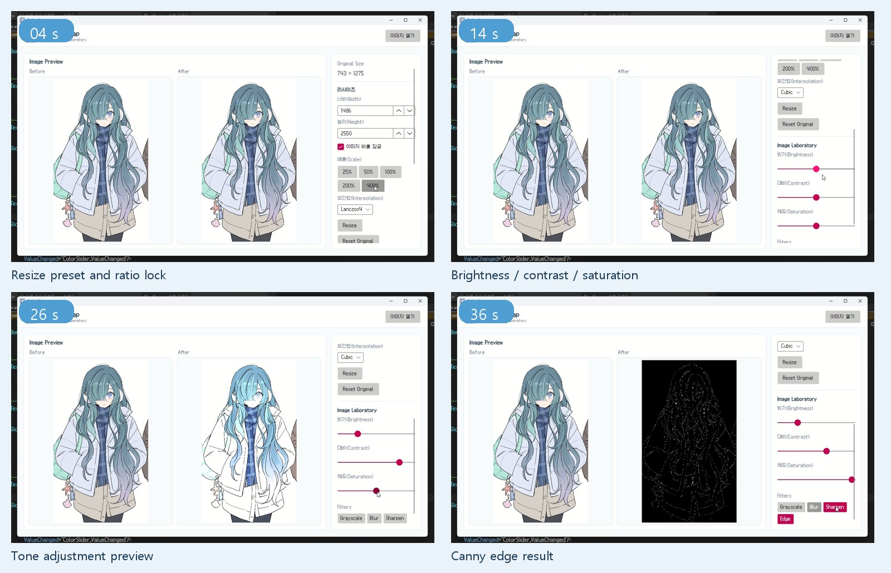
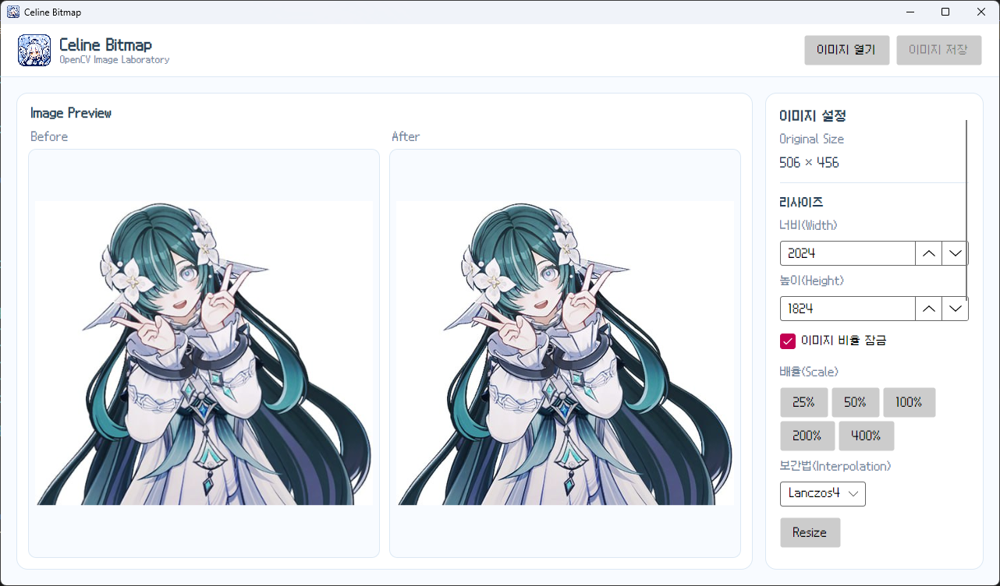
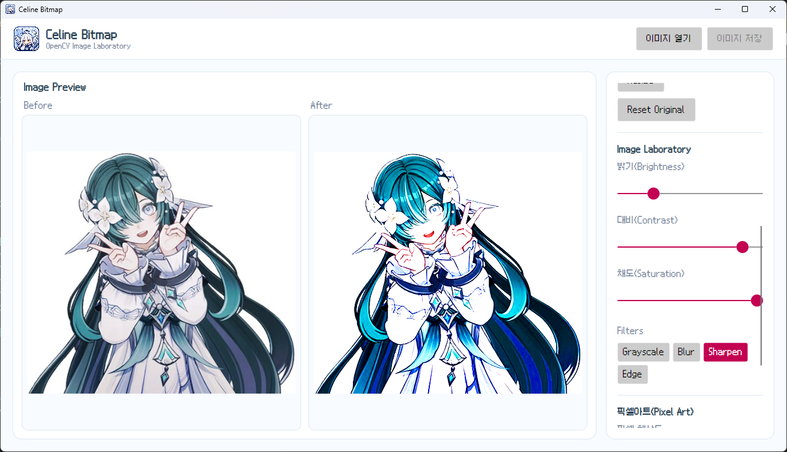
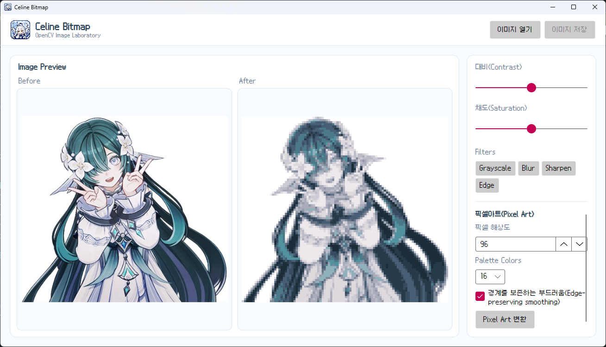
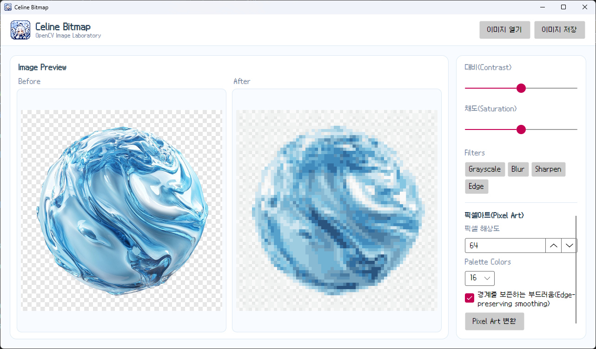
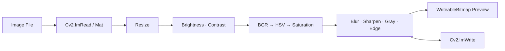
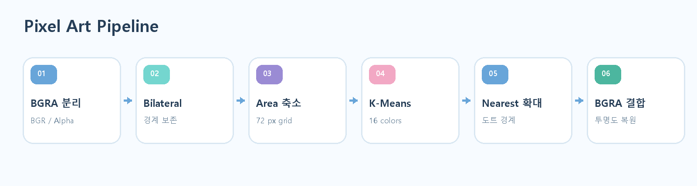
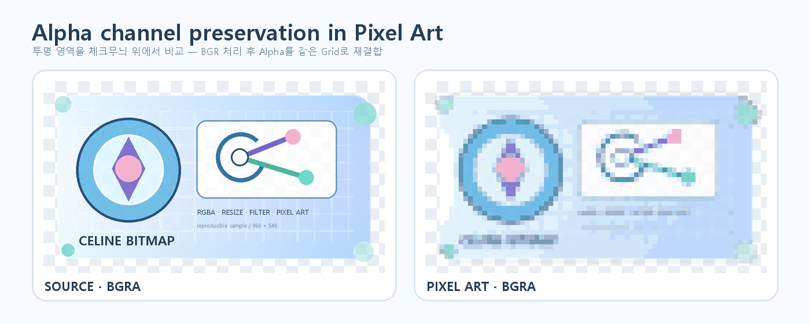

# CelineBitmap

<p align="center">
  
</p>

<p align="center">
  <strong>OpenCV Image Laboratory</strong><br />
  C# · Avalonia UI · OpenCvSharp5로 만든 이미지 처리 및 픽셀아트 변환 연습 프로젝트
</p>

<p align="center">
  
  
  
</p>

이미지를 `Mat`으로 불러와 크기·색상·필터를 바꾸고, Before / After로 비교한 뒤 다시 저장합니다.
OpenCV의 기본 연산을 익혀 2D Unity 제작 도구와 RainAI 웹캠 비전 기능으로 확장하기 위해 만들었습니다.

**개발자:** 이준빈 (Celine)

> [프로젝트 포트폴리오 PDF 보기](./docs/portfolio/CelineBitmap_Portfolio.pdf)



## 실제 실행 예시

40초 실행 영상 `CelineBitmap OpenCV 테스트1.mp4`에서 추출한 대표 장면입니다. 리사이즈, 톤 조절, Canny Edge까지 한 작업 흐름에서 확인할 수 있습니다.



| 리사이즈 | 톤·필터 조절 |
| --- | --- |
|  |  |

| 픽셀아트 변환 | Unity 2D 물의 구체 리소스 제작 |
| --- | --- |
|  |  |

제공된 실제 작업 자료와 처리 조건은 포트폴리오 PDF의 32~37쪽 사례 부록에 정리했습니다.

## 주요 기능

| 영역 | 기능 |
| --- | --- |
| Image I/O | PNG, JPG, JPEG, BMP, WebP 열기 / PNG, JPEG 저장 |
| Preview | 원본(Before)과 처리 결과(After) 비교 |
| Resize | 직접 크기 입력, 비율 잠금, 25% · 50% · 100% · 200% · 400% |
| Interpolation | Lanczos4, Cubic, Area, Nearest |
| Color | 밝기, 대비, 채도 |
| Filters | Grayscale, Gaussian Blur, Sharpen, Canny Edge |
| Pixel Art | 픽셀 해상도, 8~64색 Palette, 경계 보존 Smoothing |
| Alpha | 픽셀아트 변환 시 BGRA의 투명도 채널 보존 |

`Bilateral`과 `Threshold` 함수도 서비스에 구현되어 있으나 현재 UI에는 아직 연결하지 않았습니다.

## 처리 흐름

일반 조정은 매번 원본에서 다시 계산합니다. 슬라이더를 반복해서 움직여도 이전 결과 위에 필터가 계속 누적되지 않으며, 마지막 입력 후 100ms가 지나면 처리하는 debounce를 사용합니다.



픽셀아트는 색상과 투명도를 나누어 처리합니다.



1. BGRA 입력에서 BGR과 Alpha를 분리합니다.
2. 선택적으로 `BilateralFilter`로 경계를 보존하며 색을 정리합니다.
3. `Area` 보간으로 작은 픽셀 Grid를 만듭니다.
4. K-Means로 BGR 색상을 지정한 Palette 수로 제한합니다.
5. `Nearest` 보간으로 원래 해상도까지 확대합니다.
6. Alpha도 같은 Grid로 변환한 뒤 BGR과 다시 결합합니다.



## 보간법 선택

| 보간법 | 권장 용도 | 특징 |
| --- | --- | --- |
| Lanczos4 | 사진·일러스트 확대 | 8×8 이웃을 사용해 선명하지만 계산량이 큼 |
| Cubic | 부드러운 확대 | Bicubic 방식으로 픽셀 사이 값을 추정 |
| Area | 이미지 축소 | 픽셀 면적 관계를 이용해 다운샘플링에 적합 |
| Nearest | 픽셀아트 확대 | 가장 가까운 픽셀을 복제해 도트 경계를 유지 |

`Cubic`으로 가로·세로를 2배로 만들면 출력 해상도는 정확히 2배가 됩니다. 다만 원본에 없던 디테일을 복원하는 AI 초해상도는 아니며, 주변 픽셀을 이용한 보간 결과입니다.

## 기술 스택

- C# / .NET 10
- Avalonia UI 12.1.2
- CommunityToolkit.Mvvm 8.4.2
- OpenCvSharp5 5.0.0.20260905
- OpenCvSharp5.AvaloniaExtensions
- Git / GitHub

## 프로젝트 구조

```text
CelineBitmap/
├─ CelineBitmap/
│  ├─ Assets/                  # 아이콘과 Galmuri9 폰트
│  ├─ Services/
│  │  ├─ ImageProcessor.cs     # I/O, resize, color, filters
│  │  └─ PixelArtProcessor.cs  # K-Means pixel-art pipeline
│  ├─ ViewModels/
│  └─ Views/
│     ├─ MainWindow.axaml      # Before / After UI
│     └─ MainWindow.axaml.cs   # 상태, 이벤트, debounce, Dispose
├─ docs/images/                # 재현 가능한 포트폴리오 예시 이미지
└─ docs/portfolio/             # 프로젝트 포트폴리오 PDF
```

## 실행

필요 환경: [.NET 10 SDK](https://dotnet.microsoft.com/download/dotnet/10.0), Windows x64

```powershell
git clone https://github.com/Celine2358/CelineBitmap.git
cd CelineBitmap
dotnet restore .\CelineBitmap\CelineBitmap.slnx
dotnet run --project .\CelineBitmap\CelineBitmap.csproj
```

Release 빌드:

```powershell
dotnet build .\CelineBitmap\CelineBitmap.slnx -c Release
```

## 코드 예시

```csharp
using Mat image = Cv2.ImRead(path, ImreadModes.Unchanged);
using Mat resized = ImageProcessor.Resize(
    image,
    image.Width * 2,
    image.Height * 2,
    InterpolationFlags.Cubic);

Cv2.ImWrite("CelineBitmap_Output.png", resized);
```

핵심 코드는 [ImageProcessor.cs](./CelineBitmap/Services/ImageProcessor.cs), [PixelArtProcessor.cs](./CelineBitmap/Services/PixelArtProcessor.cs), [MainWindow.axaml.cs](./CelineBitmap/Views/MainWindow.axaml.cs)에서 볼 수 있습니다.

## 현재 상태와 다음 단계

- Release 빌드는 성공합니다. 현재 `PixelArtProcessor.cs`의 nullable 분석 경고 1개가 남아 있습니다.
- 자동 테스트 프로젝트는 아직 없습니다.
- 초소형 이미지와 `Palette Colors > 축소된 픽셀 수` 입력에는 추가 방어가 필요합니다.
- Pixel Art를 일반 조정 파이프라인의 상태로 통합하면 반복 적용과 슬라이더 재계산 동작이 더 일관됩니다.
- 다음 프로젝트에서는 ABKO APC850 웹캠을 사용해 `VideoCapture → 얼굴 검출 → 정렬 → 임베딩 → 유사도 비교 → 여러 프레임 안정화` 순서로 RainAI 얼굴 인식을 실험할 예정입니다.
- 사전학습 YuNet/SFace baseline 이후에는 여러 촬영 세션의 얼굴 embedding으로 개인화 분류와 `Unknown` 임계값을 학습·보정하는 것이 목표입니다.

얼굴 데이터는 로컬 저장·삭제 정책과 사용자 동의를 먼저 정하고, 오인식보다 `Unknown` 판정을 우선하는 방향으로 설계합니다.

## 참고

- [OpenCV: Geometric Image Transformations](https://docs.opencv.org/4.13.0/da/d54/group__imgproc__transform.html)
- [OpenCV: K-Means Clustering](https://docs.opencv.org/4.13.0/d1/d5c/tutorial_py_kmeans_opencv.html)
- [OpenCV: Canny Edge Detection](https://docs.opencv.org/4.13.0/da/d22/tutorial_py_canny.html)
- [OpenCvSharp official repository](https://github.com/shimat/opencvsharp)
- [Avalonia documentation](https://docs.avaloniaui.net/docs/get-started)
